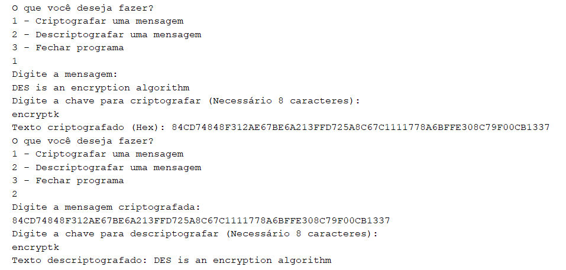

<h1 align="center">Data Encryption Standard Algorithm </h1>

## Project 
This project is about a symmetric-key encryption system, which implements the DES algorithm. Some of its characteristics are:
- The same key is used for encryption and decryption of a message unlinke asymmetrical systems;
- The algorithm works with a 64-bit key, which is why it's considered a legacy approach given modern computing power;
- It's a block cipher, which means it operates on fixed-size blocks of plaintext (64 bits).

## Algorithm Operation
To execute, the user must specify the action (encryption or decryption). Then, they enter the target message and the key, which must be exactly 8 characters long.

  <table style="border-collapse: collapse; margin: 10px;">
    
  </table>

## Technologies Used 

- **Programming Language:** Java
